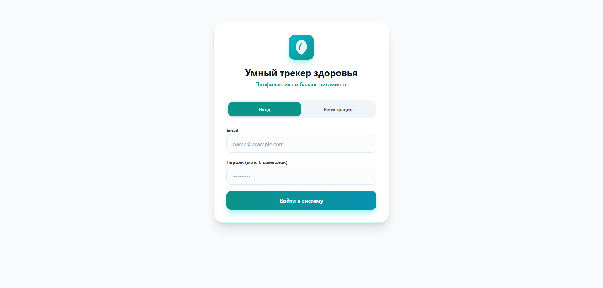
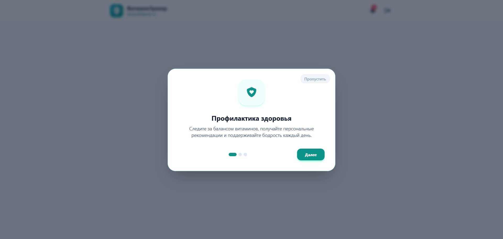
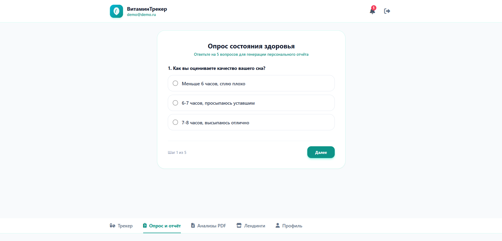
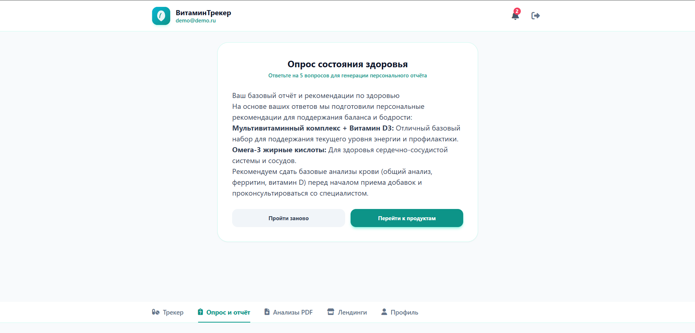
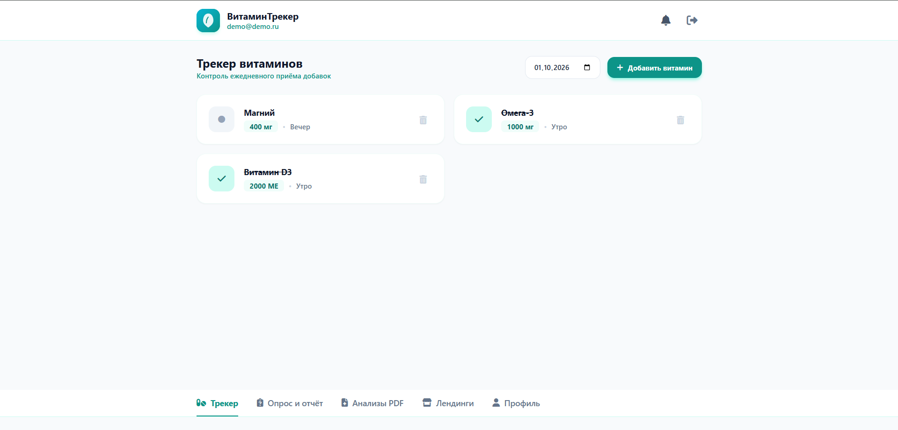
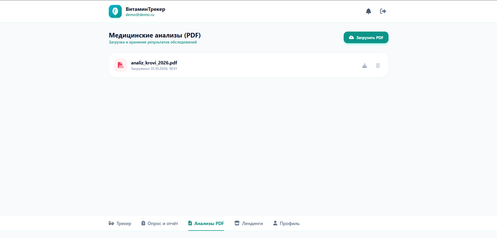

# VitaminTracker — потребительское веб-приложение для контроля здоровья

Вход и регистрация, онбординг для новых пользователей, опрос состояния здоровья с генерацией персонального отчёта, трекер ежедневного приёма со слотами утро/вечер и отметками по датам, загрузка и хранение PDF-анализов, веб-пуш напоминания. Стек: Python, Flask, Railway.

**🌐 Живое демо:** https://vitamin-tracker-production.up.railway.app
**🔑 Тестовый вход:** demo@demo.ru / demo123456

## Скриншоты








---

## Функционал

- Регистрация и вход по email
- Онбординг из 3 экранов
- Трекер витаминов с отметкой приёма и историей по датам
- Опрос из 5 вопросов с персональным отчётом и рекомендациями
- Загрузка, скачивание и удаление PDF-анализов
- Профиль: ФИО, пол, возраст, цели здоровья
- Журнал напоминаний и веб-уведомления
- Переходы на лендинги партнёрских продуктов

## Локальный запуск (для разработчиков)

```bash
pip install -r requirements.txt
python app.py
```

---

VitaminTracker · собрано вайб-кодингом · 2026
